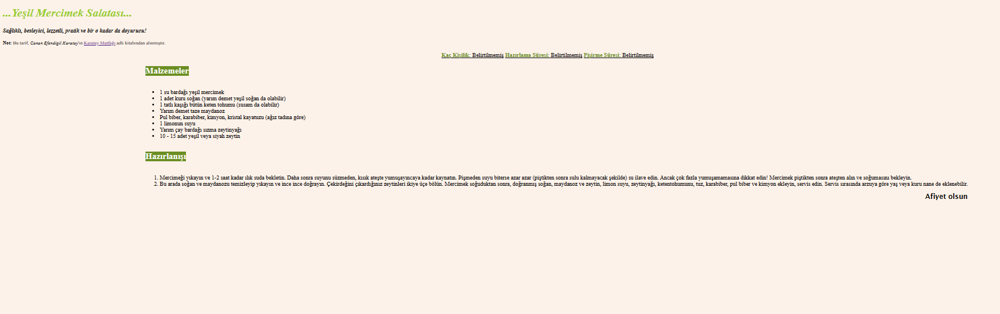

# Patika.dev - HTML - 3rd Homework 
In the HTML course at [Patika.dev](https://patika.dev), we were asked to create a recipe page. I created a structure similar to the page that was given as an example in the assignment, and I wrote a recipe that I love in this structure. 

The screenshot is below: 

